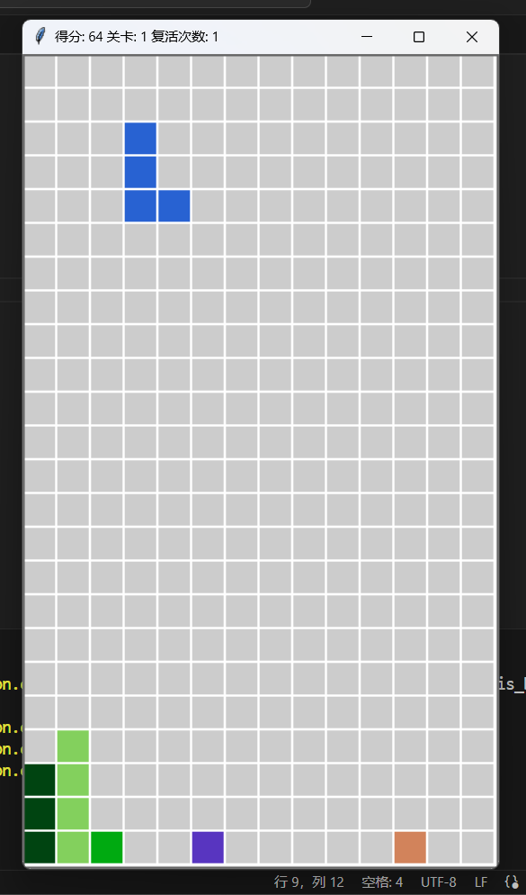

# Tetris_v2
俄罗斯方块v2.0，基于Python实现

## 改进

1. 设计了5个关卡，达到一定的分数自动进入下一关。越后面的关卡下落速度越快，出现的方块越难消除。
2. 设计了若干新方块：
-  1\*1的红色小炸弹，停下后，炸掉3*3范围内的方块，炸掉的每个方块+1积分(包括炸弹自己)。炸弹比消除一行的优先级更高。
-  紫色的加号炸弹，停下后，清除3行3列，清除掉的每个方块+1积分(包括炸弹自己)。炸弹比消除一行的优先级更高。
-  其他各种形状的方块。
3. 复活：死亡时，消耗一次复活次数，清除上半屏幕并继续游戏。
4. 更新了得分规则，一次性消除多行方块时得分更高。

## 参考项目
[BigShuang.俄罗斯方块](https://github.com/BigShuang/Tetris)

## 运行截屏

