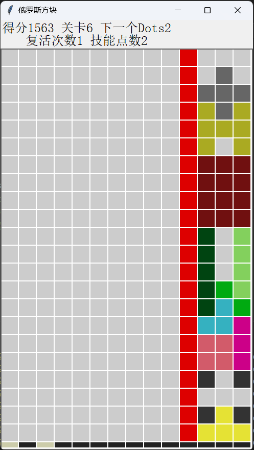
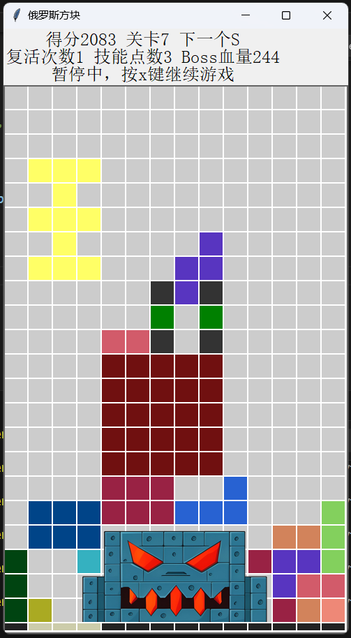

# Tetris_v2
俄罗斯方块v2.0，基于Python实现

## 改进

1. 设计了若干关卡，达到一定的分数自动进入下一关。越后面的关卡下落速度越快，出现的方块越难消除。在最后一关设计了一个Boss，Boss有多个阶段。
2. 设计了若干新方块：
-  1\*1的红色小炸弹，停下后，炸掉3*3范围内的方块，炸掉的每个方块+1积分(包括炸弹自己)。炸弹比消除一行的优先级更高。
-  紫色的加号炸弹，停下后，清除3行3列，清除掉的每个方块+1积分(包括炸弹自己)。炸弹比消除一行的优先级更高。
-  其他各种形状的方块。
3. 新增被动技能"复活": 死亡时，消耗1次复活次数，清除上半屏幕并继续游戏。
4. 新增主动技能"清屏": 消耗1个技能点，释放技能清屏。每3关获得1个技能点。  
5. 更新了得分规则，一次性消除多行方块时得分更高。
6. 顶部标签提示下一个方块，底部指示条提示下落位置。   
7. 新增开始界面。
8. 新增暂停功能。
9. 优化了运行性能，修复了已知的bug。

 
## 参考项目
[BigShuang.俄罗斯方块](https://github.com/BigShuang/Tetris)

## 运行截屏
 

